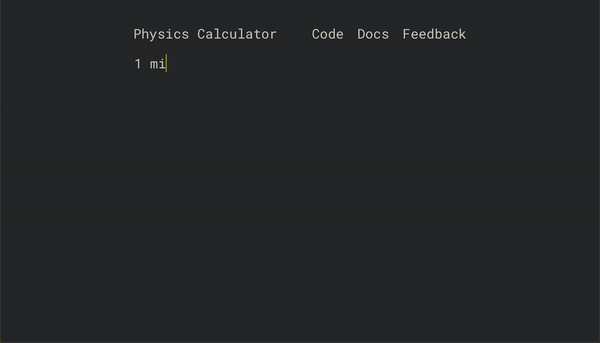

# Physics Calculator

A simple program to calculate expressions with physical units.

This is a miniature version of some broader compiler/interpreter techniques,
for fun/to help me learn C better.

### Usage

See [docs](docs.md).

### Develop

(Everything from the project's root directory. Assumes clang is installed.)

Run:
- Build + run: `make`
- With debug logs: `make DEBUG=1`

Test:
- Build + test: `make test`
- With debug logs: `make test DEBUG=1`
- Specific test case: `make test test=3 case=4`
- Disable spawning separate processes for each test/case: `make test fork=0`

Build to wasm:
- Download and install [emscripten](https://emscripten.org/docs/getting_started/downloads.html)
- `make wasm`
- Serve files: `python3 -m http.server --directory website`
- Open http://localhost:8000

See the makefile for more info.

Contributors welcome!

### To do

Things I'd like to do at some point:
- Add the rest of the of the [SI units](https://en.wikipedia.org/wiki/International_System_of_Units)
- Add a bunch of builtin unit aliases like newtons, watts, mph
    - Somehow show results in simplified forms using unit aliases
    - Would be cool to add non-physics unit stuff like storage/memory sizes (bytes, kb, mb, gb, tb)
    - Other ideas: [unitconverters.net](unitconverters.net)
- Add a bunch of builtin constants like G, pi
- Support some more math/expressions like pow, log, parentheses
- Allow custom units/conversions - user can define a unit and it's conversion to an existing unit in some linear equation
- Syntax highlighting and autocompletion in the prompt
